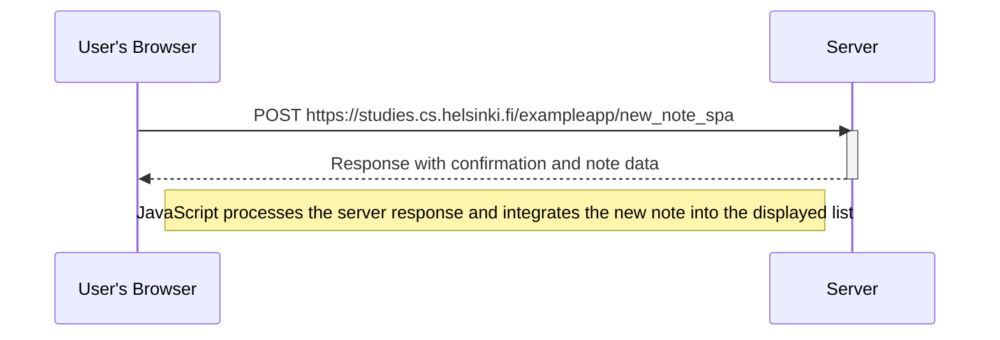

```mermaid

sequenceDiagram
    participant UserDevice as User's Browser
    participant Backend as Server

    UserDevice->>Backend: POST https://studies.cs.helsinki.fi/exampleapp/new_note_spa
    activate Backend
    Backend-->>UserDevice: Response with confirmation and note data
    deactivate Backend

    Note right of UserDevice: JavaScript processes the server response and integrates the new note into the displayed list


```